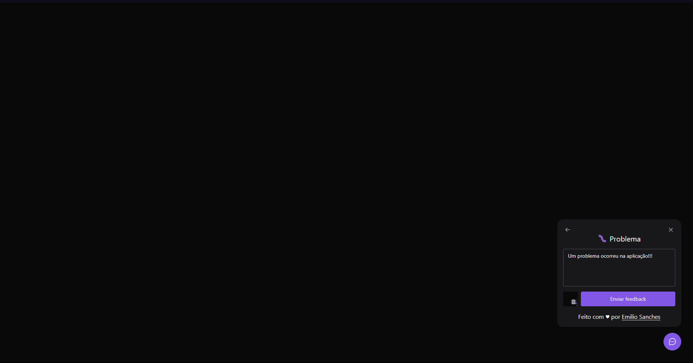

# Feedget - Widget de coleta e armazenamento de feedbacks 

Esse sistema foi desenvolvido durante a oitava edição do evento Next Level Week, realizado pela [Rocketseat](https://www.rocketseat.com.br).

O sistema consiste em uma [aplicação web](https://github.com/emiliosanches/nlw8-feedback-widget-web), um [servidor HTTP](https://github.com/emiliosanches/nlw8-feedback-widget-server) e um [aplicativo mobile](https://github.com/emiliosanches/nlw8-feedback-widget-mobile) que se comunicam via HTTP utilizando JSON como formato de dados. Além de um banco de dados relacional PostgreSQL.  
<br>

#### 🔧 Features
* Seleção de tipo de feedback entre "Problema", "Ideia" ou "Outro"
* Inserção de captura de tela da página atual
* Armazenamento de feedbacks recebidos em banco de dados
* Redirecionamento de feedbacks para endereço de e-mail do administrador da aplicação

#### 💡 Melhorias futuras
* **Web (front end)**:
  - [ ] Seleção de tema light/dark
  - [ ] Dashboard de feedbacks recebidos:
    - [ ] Tela de login
    - [ ] Tela de listagem de feedbacks

* **Server (back end)**
  - [ ] Melhorar o corpo HTML do e-mail de feedback
  - [ ] Validação de requests e tratamento de exeções
  - [ ] Dashboard de feedbacks recebidos:
    - [ ] Autenticação
    - [ ] Endpoint autorizado de listagem de feedbacks

## 🌐 Front end Web

#### 🖥️ Preview (fluxo do usuário)

<br>

<br>


<br>

#### 👨‍💻 Tecnologias e bibliotecas
* [ReactJS](https://pt-br.reactjs.org) para construção da interface web
* [TailwindCSS](https://tailwindcss.com) para estilização
* [HeadlessUI](https://headlessui.dev) para criação de componentes com acessibilidade previamente implementada
* [Axios](https://axios-http.com/ptbr/) para comunicação com o servidor HTTP

<br>

#### 🎨 Design
O protótipo do layout dessa aplicação foi feito pelo figma e pode ser encontrado [clicando aqui](https://www.figma.com/file/nez4KO3krc7bFt6vTldiaE/Feedback-Widget-(Community)?node-id=10%3A1638).
<br>

#### 🚀 Executando o projeto
* `git clone https://github.com/emiliosanches/nlw8-feedback-widget-web`
* `cd nlw8-feedback-widget-web`
* `yarn` ou `npm install`
* Crie um arquivo chamado `.env.local` na raíz do seu repositório com o seguinte conteúdo:
```env
VITE_API_URL={URL}
```
* Substitua `{URL}` pela URL local onde seu [server](https://github.com/emiliosanches/nlw8-feedback-widget-server) (back end) está rodando. Ex: `http://localhost:3333`
* `yarn start` ou `yarn dev`
<br>

#### 🔗 Repositórios relacionados
* [Server (back-end)](https://github.com/emiliosanches/nlw8-feedback-widget-server)
* [Aplicativo mobile](https://github.com/emiliosanches/nlw8-feedback-widget-mobile)